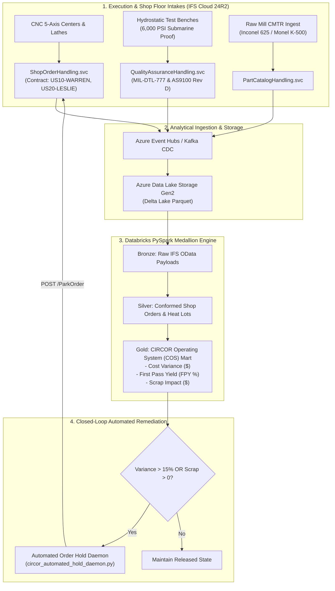

# CIRCOR International: IFS Cloud & COS Lean Manufacturing Integration

> **End-to-End Operational Intelligence & Compliance Bridge** modeled on CIRCOR International's aerospace & naval defense manufacturing footprint (Leslie Controls, Warren Pumps), AS9100 Rev D / MIL-DTL-777 compliance standards, and the CIRCOR Operating System (COS).

---

## 🏗️ System Architecture



---

## 📦 Core Deliverables & File Index

| File | Type | Description |
|---|---|---|
| [`circor_ifs_architecture_spec.md`](circor_ifs_architecture_spec.md) | Spec | Comprehensive enterprise architecture, multi-site IFS entity structure (`US10-WARREN`, `US20-LESLIE`), and data flows. |
| [`circor_mock_ifs_api.py`](circor_mock_ifs_api.py) | Service | FastAPI microservice modeling IFS Cloud Aurena OData v4 projections (`PartCatalogSet`, `ShopOrderSet`, `SubmitHydroTest`, `ParkOrder`). |
| [`circor_cos_pyspark_pipeline.py`](circor_cos_pyspark_pipeline.py) | Engine | PySpark engine calculating labor/machine cost variance, scrap dollar impact, FPY, and administrative hold flags. |
| [`circor_automated_hold_daemon.py`](circor_automated_hold_daemon.py) | Daemon | Autonomous worker consuming analytical hold flags and invoking IFS REST actions to `ParkOrder` on out-of-tolerance jobs. |
| [`scripts/run_e2e_verification.py`](scripts/run_e2e_verification.py) | Orchestration | 1-command end-to-end verification harness executing the entire closed loop with formatted executive telemetry. |
| [`tests/test_circor_integration.py`](tests/test_circor_integration.py) | Tests | Verified unit and integration test suite covering API contracts, Mil-Spec hydro validation, and PySpark logic. |

---

## ⚡ Operational Metrics & Mathematical Formulations

The **CIRCOR Operating System (COS)** enforces strict variance containment across high-alloy defense jobs:

$$\text{Labor Variance} = (\text{Actual Labor Hours} - \text{Planned Labor Hours}) \times \text{Std Labor Rate}$$

$$\text{Machine Variance} = (\text{Actual Machine Hours} - \text{Planned Machine Hours}) \times \text{Std Machine Rate}$$

$$\text{Total Cost Variance} = \text{Labor Variance} + \text{Machine Variance}$$

$$\text{First Pass Yield (FPY \%)} = \frac{\text{Revised Qty Due} - \text{Qty Scrapped}}{\text{Revised Qty Due}} \times 100$$

$$\text{Hold Trigger} = (\text{Variance \%} > 15.0) \lor (\text{Qty Scrapped} > 0)$$

---

## 🚀 Quickstart & Verification

### 1. Prerequisites
* Python 3.10+
* Java 11 or 17 (for PySpark)

```bash
pip install -r requirements.txt
```

### 2. 1-Command Closed-Loop Verification
Run the unified integration harness:
```bash
python scripts/run_e2e_verification.py
```

### 3. Step-by-Step Manual Execution

#### Terminal 1: Launch Mock IFS Cloud Service
```bash
uvicorn circor_mock_ifs_api:app --reload --port 8000
```

#### Terminal 2: Execute PySpark COS Analytics
```bash
python circor_cos_pyspark_pipeline.py
```

#### Terminal 3: Run Automated Hold Daemon
```bash
python circor_automated_hold_daemon.py
```

### 4. Run Pytest Test Suite
```bash
pytest tests/ -v
```

---

## 🐳 Docker Deployment

```bash
# Build and run with docker-compose
docker-compose up --build
```
