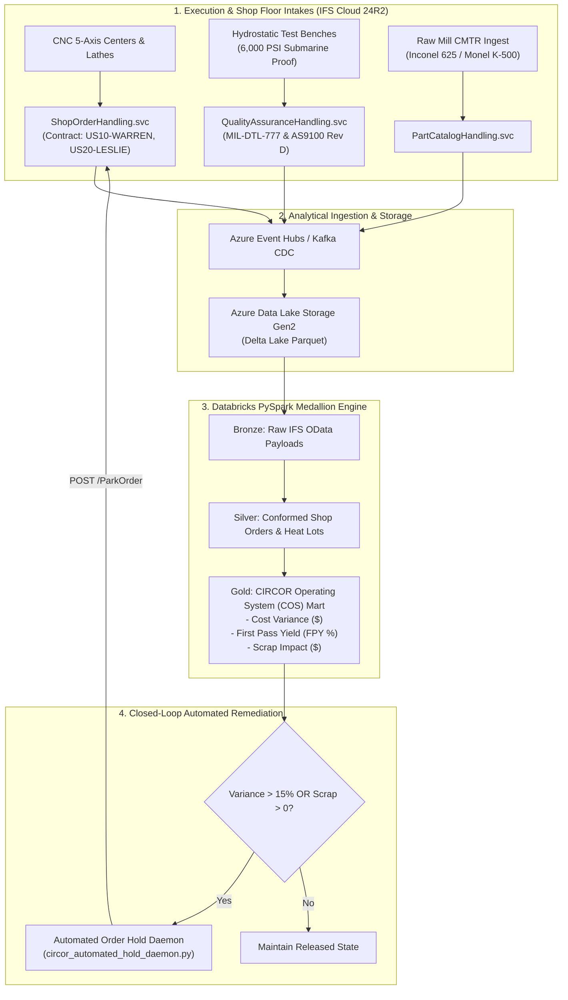

# CIRCOR International: IFS Cloud Manufacturing & Quality Architecture Specification

## 1. Enterprise Profile & Industrial Scope
CIRCOR International manufactures severe-service flow control products (cryogenic control valves, high-pressure naval submarine ball valves, positive displacement pumps) across its global operating brands (such as Leslie Controls, Warren Pumps, and Portland Valve). 

Key operating requirements:
* **Manufacturing Paradigms:** Engineer-to-Order (ETO) and Configure-to-Order (CTO).
* **Quality Standards:** AS9100 Rev D, MIL-DTL-777, and ASME Section III (Nuclear/Submarine).
* **Traceability:** Full backward and forward genealogy covering raw mill Heat Lot numbers, Certified Material Test Reports (CMTR), Nondestructive Testing (NDT), and hydrostatic pressure test logs.
* **Execution Framework:** CIRCOR Operating System (COS) focusing on Lean flow, First Pass Yield (FPY), scrap elimination, and variance containment.

## 2. Multi-Site IFS Cloud Entity Structure
* **Corporate Ledger / Parent Contract:** `US01-HQ` (Burlington, MA)
* **Site 1:** `US10-WARREN` (Warren Pumps, MA - Naval defense pumps and heavy alloy machining)
* **Site 2:** `US20-LESLIE` (Leslie Controls, FL - Severe-service and cryogenic control valves)
* **Site 3:** `EU10-WEINHEIM` (CIRCOR Germany - Industrial engineered pumps)

## 3. Data Integration & Event Flow Architecture

```text
[ Shop Floor Machines & Hydro Test Benches ]
                      │
                      ▼ (REST / OData v4)
      [ IFS Cloud 24R2 (Aurena / Oracle 19c) ]
        ├── PartCatalogHandling.svc
        ├── ShopOrderHandling.svc
        ├── ShopFloorWorkbenchHandling.svc
        └── QualityAssuranceHandling.svc
                      │
                      ▼ (Change Data Capture / Event Hubs)
         [ Azure Data Lake Storage Gen2 ]
                      │
                      ▼ (PySpark Medallion Architecture)
       [ Databricks / PySpark Analytical Engine ]
        ├── Bronze: Raw IFS OData Payloads
        ├── Silver: Conformed Shop Orders, Operations & Heat Lots
        └── Gold  : CIRCOR Operating System (COS) Variance & FPY Mart
                      │
                      ├──► [ Executive Dashboards / COS KPI Portals ]
                      │
                      ▼ (OData Reverse Action)
      [ Automated IFS Quality / Financial Hold Daemon ]
```



## 4. Quality & Defense Compliance Protocols
1. **Heat Lot Traceability:** Every machined casting and forged billet must trace to an authentic Certified Material Test Report (CMTR) with mechanical and chemical certification.
2. **Hydrostatic Testing:** Submarine ball valves and cryogenic globe valves must undergo hold times at 1.5x design pressure (e.g. 6,000 PSI) with zero allowable leak rate (`leak_rate_scfh = 0.0`).
3. **Variance Threshold Containment:** If actual labor or machine hours exceed standard cost allowance by >15%, the shop order is automatically transitioned to `Parked` status in IFS Cloud until approved by Quality and Finance.
