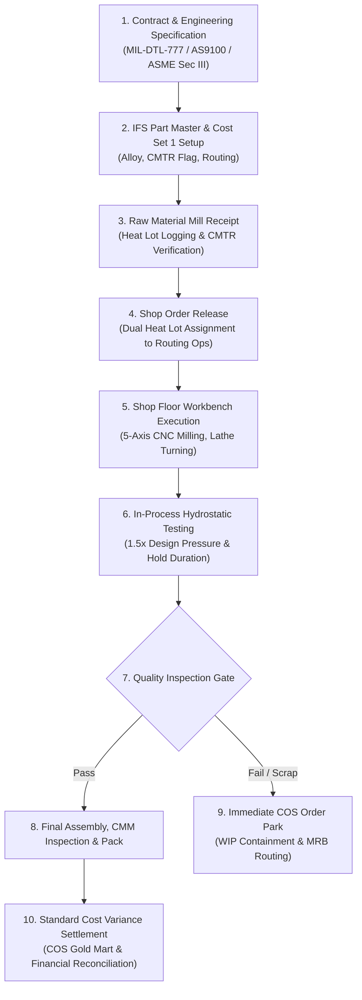

# CIRCOR International: ETO/CTO Valve & Pump Manufacturing Lifecycle

## 1. Executive Summary & Manufacturing Context
CIRCOR International operates mission-critical manufacturing facilities delivering severe-service flow control hardware to the United States Navy, defense prime contractors, nuclear propulsion programs, and cryogenic industrial sectors.

Key operating entities:
* **Leslie Controls, Inc.** (Tampa, FL): Cryogenic control valves, severe-service steam conditioning valves, naval 3-way regulator valves.
* **Warren Pumps LLC** (Warren, MA): Rotary and centrifugal positive displacement submarine pumps, severe-duty titanium and Monel pumping systems.
* **Portland Valve** (Warren, ME): High-pressure submarine hull valves and specialized naval ball valves.

These products are engineered under two primary operational paradigms:
1. **Engineer-to-Order (ETO):** Custom fluid-dynamic designs tailored to specific naval hull penetrations, cryogenic liquefaction temperatures (-320°F), or nuclear submarine shock profiles (MIL-S-901D).
2. **Configure-to-Order (CTO):** Standard valve bodies customized with specific exotic alloy trim sets (Inconel 625, Monel K-500, Stellite 6 cladding), packing arrangements, and hydrostatic test pressures.

---

## 2. End-to-End Operational Lifecycle Workflow

---

## 3. Operational Phases Breakdown

### Phase 1: Engineering & Master Data Configuration
- **Design Review:** CAD models and fluid dynamics calculations establish valve wall thickness and pressure classes (Class 150 to Class 2500).
- **IFS Part Catalog (`PartCatalogHandling.svc`):**
  - Configured with `cost_set = 1` (Standard Frozen Cost).
  - Material alloy stamped: `Inconel 625`, `Monel K-500`, or `316L SS`.
  - Quality specification assigned: `MIL-SPEC-777`, `AS9100 Rev D`, or `NAVSEA 250-1500-1`.
  - Mandatory flag: `requires_cmtr = true`.

### Phase 2: Raw Material Ingestion & Defense Genealogy
- Castings and forgings arrive from certified domestic foundries.
- Certified Material Test Reports (CMTR) are verified for chemical composition and tensile strength.
- Each raw casting is tagged with a unique Mill Heat Lot number (`heat_lot_no`).
- In IFS Cloud, inventory lots are assigned directly to the heat lot, ensuring 100% backward and forward genealogy.

### Phase 3: Shop Order Release & Routing
- Manufacturing bills of materials (MBOM) and standard routings are generated:
  - Op 10: Heavy alloy turning (CNC Lathe).
  - Op 20: 5-Axis contour milling and porting.
  - Op 30: Stellite weld overlay and hardfacing.
  - Op 40: Hydrostatic shell and seat pressure testing.
  - Op 50: Non-Destructive Testing (Liquid Penetrant / Radiography).
- Heat lot numbers are bound to shop order operations (`ShopOrderHandling.svc/ShopOrderSet`).

### Phase 4: Shop Floor Workbench Execution
- Machinists log into the tailored IFS Cloud Aurena Shop Floor Workbench.
- Real-time clocking captures actual labor hours and machine hours against standard rates.
- Operator UI enforces scrap entry with mandatory AS9100 root cause categorization (tool failure, inclusion defect, setup error).

### Phase 5: Hydrostatic Testing & Quality Gates
- Valves undergo hydrostatic proof testing (e.g., 3,750 PSI for 15 minutes) per MIL-DTL-777.
- Digital test benches stream pressure curves and badge certifications to `QualityAssuranceHandling.svc`.
- Any pressure drop or casting weepage immediately fails the test record.

### Phase 6: CIRCOR Operating System (COS) Operational Intelligence
- High-frequency lakehouse pipeline ingests IFS shop floor clocking and quality logs.
- PySpark engine evaluates standard cost variances (Labor Variance, Machine Variance, FPY %).
- Operations breaching variance tolerance (>15%) or incurring scrap (>0 units) trigger immediate remediation.

### Phase 7: Closed-Loop Containment & Cost Settlement
- The automated hold daemon calls IFS action `ParkShopOrder`, freezing subsequent routing operations.
- Material Review Board (MRB) evaluates the quarantined component.
- Sunk labor and machine costs are reconciled against Cost Set 1 to contain manufacturing financial drift.
